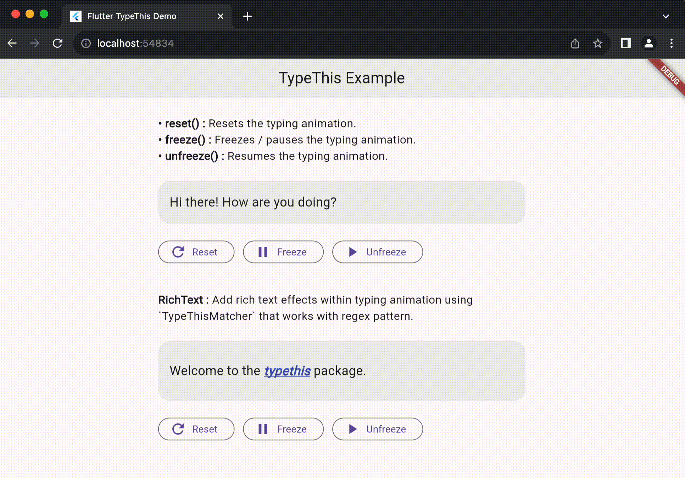

# TypeThis

[](https://github.com/thecodexhub/typethis/actions)
[](https://codecov.io/gh/thecodexhub/typethis)
[](https://opensource.org/licenses/MIT)
[](https://pub.dev/packages/typethis)

A flutter package that aims to simplify versatile typing animation with rich text effects and other operations (reset, freeze, unfreeze).

## Create and style TypeThis widget

The `TypeThis` widget requires only one essential parameter: `string`. This parameter represents the text that will undergo animation.

Additionally, you can customize the animation speed using the optional `speed` parameter, with a default value of 50 milliseconds. This implies that each character in the provided text will be rendered at intervals of 50 milliseconds, creating a dynamic and engaging typing effect.

Here is an example:

```dart
TypeThis(
  string: 'An example string with typing animation.',
  speed: 150,
);
```

The `TypeThis` widget gives users the complete control over text rendering, offering all the parameters available in the standard `Text` widget.

```dart
TypeThis(
  string: 'An example string with typing animation.',
  speed: 150,
  style: TextStyle(
    fontSize: 24,
    fontWeight: FontWeight.bold,
    color: Colors.indigo,
  ),
  textAlign: TextAlign.center,
);
```

## Control the animation

To control the typing animation, create a `TypeThisController` and supply it to the `TypeThis` widget.

> 📘 **Important**
> 
> Call `dispose` of the `TypeThisController` when you’ve finished using it. This ensures that you discard any resources used by the object.

```dart
// Define a custom widget.
class MyTypingWidget extends StatefulWidget { ... }

class _MyTypingWidgetState extends State<MyTypingWidget> {
  // Create a typethis controller.
  final myController = TypeThisController();

  @override
  void dispose() {
    // Clean up the controller when the widget is disposed.
    myController.dispose();
    super.dispose();
  }
}
```

Now that you have a `TypeThisController`, wire it up to a text field using the controller property.

```dart
TypeThis(
  string: 'An example string with typing animation.',
  controller: myController,
);
```

After supplying the `TypeThisController`, begin controlling the typing animatiomn. Use the reset() method provided by the TypeThisController to resets the typing animation and restart it from the beginning.

Similarly, use the freeze() and unfreeze() methods to pause/freeze and resume/unfreeze the animation respectively.

```dart
// Reset
myController.reset();

// Freeze / Pause
myController.freeze();

// Unfreeze / Resume
myController.unfreeze();
```

## Bring in RichText effects

One standout feature of this package is the ability to incorporate rich text styling within the typing animation.

Add rich text effects within typing animation using `TypeThisMatcher` that works with regex pattern.

```dart
TypeThis(
  string: 'Welcome to the typethis package.',
  richTextMatchers: const [
    TypeThisMatcher(
      'typethis',
      style: TextStyle(
        fontWeight: FontWeight.bold,
        fontStyle: FontStyle.italic,
      ),
    ),
  ],
);
```

Use the TypeThisController to manage and control the animations as well. [Read here](#control-the-animation).

## Demo

[](https://github.com/thecodexhub/typethis)

## License

The project is released under the [MIT License](LICENSE). Learn more about it, [here](https://opensource.org/license/mit/).

---

<p align="center">
  <p align="center">
    Developed and Maintained with 💜 by <a href="https://github.com/thecodexhub">thecodexhub</a>
  </p>
  <p align="center">
    <a href="https://github.com/thecodexhub/typethis">
      
    </a>
  </p>
</p>
